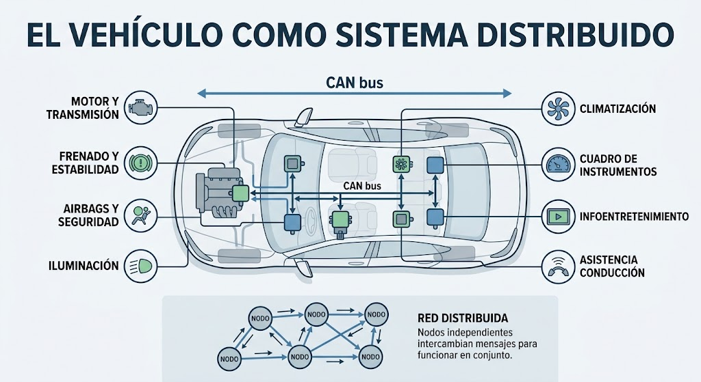

# Arquitectura de vehículos y ECUs

Un vehículo  no es únicamente un sistema mecánico. Es una plataforma distribuida formada por sensores, actuadores, redes de comunicación y unidades de control electrónico.


El estudio de sistemas automotrices debe realizarse únicamente sobre vehículos, componentes y laboratorios propios o expresamente autorizados.


## El vehículo como sistema distribuido

Los vehículos actuales integran numerosos sistemas electrónicos que trabajan de forma coordinada. Cada sistema puede encargarse de una función concreta, pero necesita intercambiar información con otros módulos para que el vehículo funcione correctamente.

Entre las funciones gestionadas electrónicamente se encuentran:

* Control del motor y de la transmisión.
* Frenado y estabilidad.
* Airbags y sistemas de seguridad pasiva.
* Iluminación y carrocería.
* Climatización.
* Instrumentación del cuadro.
* Infoentretenimiento y conectividad.
* Asistencia a la conducción.

Esta arquitectura se parece, a nivel conceptual, a una red distribuida: existen múltiples nodos independientes que intercambian mensajes y colaboran para ofrecer una función común.

En la siguiente imagen vemos una imagen conceptual del vehículo como sistema distribuido:

<figure><figcaption></figcaption></figure>

Obviamente, esta imagen tiene sus errores, pero a día de la fecha no se encontró algo mejor.&#x20;

Lo importante aquí es que vayas viendo cómo interactuan las diferentes funciones o servicios que hay dentro de un auto.&#x20;

### Evolución de la Arquitectura de un Auto: Del Sistema Distribuido **E/E** (arquitectura eléctrica y electrónica) al Vehículo Definido por Software (SDV)

Previamente vimos cómo era un auto tradicional. Para entender cómo se concibe el automóvil moderno como un sistema distribuido, es necesario repasar su evolución arquitectónica electrónica y de software. En la siguiente imagen podemos ver un poco cómo fue la evolución:

<figure><figcaption></figcaption></figure>

#### La Era Tradicional (Arquitectura Distribuida y Basada en Dominio)

Historicamente, los vehículos dependían de una aproximación puramente centrada en el hardware. Cada nueva función (frenos ABS, control de clima, ventanas eléctricas) requería su propia ECU (Unidad de Control Electrónico) independiente con software acoplado y cerrado.

Esto resultó en una red hiper-distribuida con decenas (e incluso cientos) de ECUs aisladas conectadas por mallas complejas de cableado (_harnesses_), lo que generaba cuellos de botella, alto peso físico e imposibilidad de actualizar el vehículo sin intervención en taller.

#### El Salto al Vehículo Definido por Software (SDV)

El concepto de Software-Defined Vehicle (SDV) invierte este paradigma: el software pasa a ser el núcleo que define las capacidades del vehículo, desacoplándose del hardware subyacente.

Esta transición se logra consolidando la red del auto mediante dos pilares estructurales:

* Computación Centralizada (HPCs): Se reemplazan docenas de ECUs dedicadas por una o dos computadoras de alto rendimiento (_High-Performance Computers_) que procesan la lógica central (IA, conducción autónoma, infoentretenimiento).
* Arquitectura Zonal (_Zonal Architecture_): Se organizan concentradores locales o _gateways_ por ubicación física en el vehículo (zona frontal, trasera, puertas), reduciendo drásticamente la longitud y complejidad del cableado.

#### Caracterizaciones Clave del SDV como Sistema Distribuido Moderno

1. Desacoplamiento de Hardware y Software: Permite desarrollar y actualizar aplicaciones de forma modular sin rediseñar los componentes mecánicos o electrónicos.
2. Actualizaciones Over-The-Air (OTA): Capacidades para corregir fallos, integrar nuevas funciones o desplegar parches de seguridad de manera remota e inalámbrica.
3. Conectividad Continua e Integración Cloud: Conexión de alta velocidad (5G, Wi-Fi) para recopilar telemetría en tiempo real y ejecutar servicios digitales avanzados.


Para entrar más en detalle sobre este tema, te dejamos algunos artículos que fueron referencias para este capítulo.


## ¿Qué es una ECU?

Una **ECU**, del inglés _Electronic Control Unit_, es una unidad de control electrónico. Puede recibir información de sensores, procesarla mediante software y controlar actuadores u otros componentes.

Una ECU suele incluir:

* Un microcontrolador o procesador.
* Memoria para el firmware y los datos.
* Entradas para sensores.
* Salidas para actuadores.
* Interfaces de comunicación.
* Requisitos específicos de alimentación y seguridad.

No todas las ECUs tienen la misma complejidad. Algunas realizan tareas sencillas y otras ejecutan funciones críticas que requieren respuestas deterministas, tolerancia a fallos y mecanismos de diagnóstico.

Algunas imágenes de ECU:

<figure><figcaption></figcaption></figure> <figure><figcaption></figcaption></figure>

## Software embebido

El software de una ECU se ejecuta en un entorno embebido. Dependiendo del fabricante, la generación del vehículo y la función del módulo, puede utilizarse un sistema operativo de tiempo real, software bare-metal o una plataforma basada en Linux u otro sistema embebido.

Los sistemas de tiempo real, conocidos como **RTOS**, están diseñados para responder dentro de límites temporales definidos. Esta característica es especialmente relevante cuando una ECU participa en funciones que requieren respuestas rápidas y predecibles.

Desde la perspectiva de seguridad, una ECU debe estudiarse como una combinación de hardware, firmware, interfaces y protocolos. Analizar únicamente el software no ofrece una visión completa del sistema.

## Comunicación entre módulos

Las ECUs necesitan compartir información. Para ello utilizan redes internas del vehículo y protocolos específicos. Una red muy extendida es **CAN**, abreviatura de _Controller Area Network_.

CAN permite que distintos módulos intercambien mensajes sobre un bus común. En lugar de establecer una conexión independiente entre cada par de ECUs, varios módulos pueden transmitir y recibir información dentro de la misma red.

La comunicación interna puede transportar datos relacionados con:

* Estado de sensores.
* Información del motor.
* Estado de puertas y luces.
* Diagnóstico.
* Alertas y eventos del vehículo.

La organización exacta de los mensajes, los permisos y la separación entre redes dependen del fabricante y del modelo. Por eso no debe asumirse que todos los vehículos tienen la misma arquitectura.

## Dominios y separación de funciones

Los vehículos pueden dividir sus redes en distintos dominios o segmentos. Esta separación ayuda a organizar el tráfico y puede limitar la propagación de fallos entre funciones diferentes.

Algunas arquitecturas distinguen, por ejemplo, entre:

* Sistemas de propulsión.
* Sistemas de carrocería.
* Sistemas de seguridad.
* Infoentretenimiento.
* Conectividad externa.

La existencia de segmentación no garantiza por sí sola la seguridad. También deben analizarse los gateways, las reglas de encaminamiento, la autenticación y las interfaces físicas o inalámbricas que conectan cada segmento.

## Relación con el pentesting

La experiencia previa en pentesting resulta útil para estudiar vehículos porque permite aplicar conocimientos de:

* Análisis de redes.
* Ingeniería inversa.
* Sistemas embebidos.
* Revisión de APIs.
* Seguridad móvil.
* Modelado de amenazas.
* Análisis de firmware.

Sin embargo, el contexto automotriz añade restricciones importantes. Un error de configuración o una prueba mal diseñada puede afectar componentes físicos, sistemas críticos o la seguridad de las personas.

Por este motivo, el aprendizaje debe comenzar con documentación, simuladores y componentes aislados. Las pruebas sobre vehículos reales deben tener un alcance definido, autorización explícita y procedimientos para recuperar el sistema ante un fallo.

## Ideas principales

* Un vehículo moderno es un sistema distribuido de hardware y software.
* Las ECUs controlan funciones específicas y se comunican con otros módulos.
* El software puede ejecutarse sobre RTOS, Linux embebido u otras plataformas.
* CAN es una de las redes internas más importantes, pero no es la única.
* La arquitectura varía según el fabricante y el modelo.
* La seguridad debe analizarse considerando hardware, firmware, redes e interfaces.

## Preguntas de repaso

1. ¿Qué componentes forman una arquitectura electrónica automotriz?
2. ¿Qué función cumple una ECU?
3. ¿Por qué algunos módulos utilizan sistemas operativos de tiempo real?
4. ¿Qué ventajas ofrece una red interna compartida como CAN?
5. ¿Por qué los vehículos pueden dividirse en distintos dominios?
6. ¿Qué conocimientos de pentesting son transferibles al análisis automotriz?

## Fuentes

> [https://www.keysight.com/blogs/en/inds/auto/2025/08/what-is-an-sdv](https://www.keysight.com/blogs/en/inds/auto/2025/08/what-is-an-sdv)
>
> [https://www.keysight.com/blogs/en/inds/auto/2025/09/levels-of-sdvs](https://www.keysight.com/blogs/en/inds/auto/2025/09/levels-of-sdvs)
